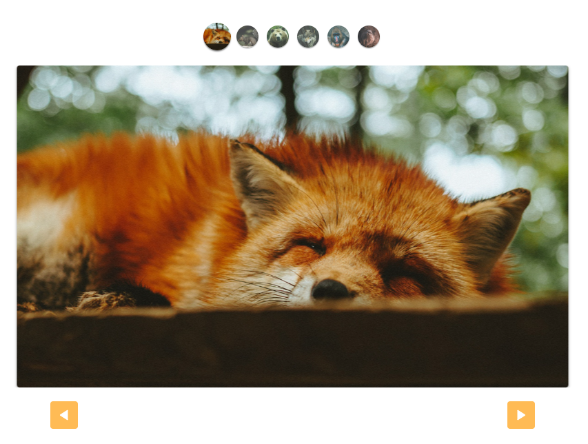

# Slide Automático



Este projeto consiste em um slide automático para exibição de conteúdo em formato de slide. Com pequenas alterações manuais no seu HTML e CSS, você pode criar um slide funcional apenas passando os containers necessários na classe.

[Acesse o site](https://rochamaatheus.github.io/Animais-Slide/index.html)


🚀 Linguagem utilizada: JavaScript

---

## Descrição do Projeto

O projeto "Animais Slide" é um site interativo que complementa o site [Animais Fantástico](https://rochamaatheus.github.io/Animais-Fantasticos/index.html). Aqui, temos apenas o slide com seu código completamente documentado para fácil uso.

## Recursos e Funcionalidades

- Slide automático
- Possibilidade de criar custom-controls

## Dependências

- HTML
- CSS
- JavaScript

## Instalação e Configuração

1. Clone este repositório:

   ```bash
   git clone https://github.com/rochamaatheus/animais-slide.git
   
2. Navegue até o diretório do projeto:

   ```bash
   cd animais-slide
   
3. Faça as alterações necessárias no HTML e CSS para personalizar o slide de acordo com suas necessidades.

## Utilização do Código em Outro Projeto

1. Crie um elemento HTML para servir como wrapper do slide.
2. Dentro do wrapper, adicione os elementos que representam os slides do seu conteúdo.
3. Adicione as classes e atributos necessários para identificar o wrapper e os slides.
4. Configure os custom-controls, se necessário, de acordo com as instruções fornecidas na documentação.

Exemplo de uso:

- Apenas o HTML e JavaScript, sem o CSS.

HTML
```html
<!-- Opcional -->
<div>
  <ul class="custom-controls">
    <li></li>
    <li></li>
    <li></li>
    <li></li>
    <li></li>
    <li></li>
  </ul>
</div>
<div class="slide-wrapper">
  <ul class="slide">
    <li></li>
    <!-- Adicione mais slides, se necessário -->
  </ul>
</div>
<!-- Botões -->
<div class="arrow-nav">
  <button class="prev"></button>
  <button class="next"></button>
</div>
```
JavaScript
```javascript
import { SlideNav } from './slide.js';

const slide = new SlideNav('.wrapper', '.slide', 'active');
slide.init();
slide.addArrow('.prev', '.next');
slide.addControl('.custom-controls');
```

## Contato

Se você tiver alguma dúvida ou precisar de assistência adicional, fique à vontade para entrar em contato através do LinkedIn, Instagram ou por e-mail. As informações de contato estão disponíveis na minha página principal do GitHub.

---

👨‍💻 Criado por [rochamaatheus](https://github.com/rochamaatheus).
